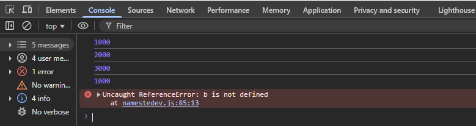

# 1. Console Functions in JS

+ ``` document.write(" Upcoming race weekend is BAHARIN GP ")```
   + we add text in webpage using js

+ ```alert("SPAS addeed alert on website frontend")```
   + addeed alert on website frontend
### *Console API Functions:*
***
+ ```console.log("SPAS added text in cosole not in website frontend"); ```
   +   added text in cosole not in website frontend

+ ```console.warn("This is an Warn on console");```  
   + Added warn in console same as warning which we are using in webpage

+ ```console.error("This is an error on console");```
    + Added error in console
+ ```console.clear()```
    + we use this function on webpage console to clear it
***
***    
# 2. Variables in js:


***
***
# 3. Operators in js


# 4. function in js
```
function avg(a , b){
    return (a+b)/2;
}

c1 = avg(2,3)
// console.log(c1)
```
# 5. if else in js
```var age = 18
if (age >= 18){
    console.log("You can drink feruchi drink");
}
else{
    console.log("You can drink Rasna");

}
```
```
age = 20    // here we have overright age variable

if ( age <= 10 ){
    console.log("Race 1-10")
}
else if(age <= 20 ){
    console.log("Race 11 -20")
}
else{
    console.log("Race with fernando alonso ")
}
```
# 6. Loops in js
## foreach used for taking out each value of array 
```
var arry = [1,2,3,4,5,6,7,8,9]

arry.forEach(element => {
    console.log(element)
});
```

```
let narry = [1,2,3,4,5,6,7,8,9];

for (let i =0; i <= narry.length; i++) {
    console.log(i);
}
```
```
for(let i = 1; i<=25 ; i++){
        console.log(i);
}
```


## while loop in js
```
warry = [1,2,3,4,5];

let w = 0;
while( w < warry.length){
console.log(warry[w]);
w++
}
```

***
***
# 7. methods in js

**metharry = [1, "two" , true , 99 ];**
+ ```console.log(metharry.length);```

+ ```metharry.pop();```  Remove last value from array

+ ```metharry.push("wheelchair");``` To add value in array at last

+ ```metharry.shift();``` Remove first value from array

+ ```metharry.unshift("new added value from unshift");``` To add value in array at front

+ ```console.log(metharry.tostring());``` To convert string to string

+ ```metharry.sort();``` Sort values in array

+ ```console.log(metharry);```
```
let ndate = new Date();
console.log(ndate.getTime());
```

# 8. doc element methods (dom)
+ ```let docid = document.getElementById("firstcontainer");``` Fetch element with firstcontainer id

+ ```console.log(docid);```

+ ### element_on_which_add[0].classList.add("name_of_class_which_add")
    ```let first_button_id = document.getElementById("btnclick");```

    ```console.log(first_button_id);```

    * ```first_button_id.classList.add("bgcolor");``` Add class property in element

    * ```first_button_id.classList.remove("textcolor");``` Remove class property from element
+ ### inner text and html
    * ```console.log(first_container.innerHTML)``` Return html of targeted element
    * ```console.log(first_container.innerText)``` Return text of targeted element

+ ### query selector
    * ```qsel = document.querySelector(".container")``` Return first container class
    * ```qsel = document.querySelectorAll(".container")``` Return all container class
    ***
    ***
# 9. Events
## In html
+ here in html we have added ```onclick="clicked()"```
+ and in js file we have created a function ```clicked()```
```
function clicked(){
    console.log("The button was clicked")
}
```
```<button id="btnclick" onclick="clicked()"> Lorem ipsum dolor sit amet.```  
+ so whenever click on button will get message in console

## Direct in js
1. For click event
```
    second_button_id.addEventListener('click' ,function(){
        console.log("The second button was clicked")
})
```
2. For mouseover event
```
second_button_id.addEventListener("mouseover",function(){
    console.log("Mouse on the second button was clicked")
} )
```
***
***
# 10. Arrow function
```
function summ(a,b){
    return a+b
}
            // OR we can also right using arrow function 
            
summ = (a,b) =>{
    return a+b
}

```
***
***
# 11. Set timeout and interval
```
 bmv = function(){
    console.log("Timeout set for 2 seconds")
} 
setTimeout(bmv, 2000)
// setInterval(bmv, 2000)    //for repeating responses

                //OR

setTimeout(function(){
    console.log("fsdfdsfdfd")
}, 2000) 

```
### timeout with event in js
```
second_button_id.addEventListener('click' ,function(){
    setTimeout(function(){
        second_button_id.innerHTML = "<b> Second button was clicked";
    console.log("The second button was clicked");
},2000);
})

```
# 12. Block scope in js

```
{
    var a = 1000;
    let b = 2000;
    const c = 3000;
    console.log(a)                 // we'll get output in console
    console.log(b)                 // we'll get output in console
    console.log(c)                 // we'll get output in console

}
console.log(a)                    // we'll get output in console
console.log(b)                    // Error
console.log(c)                    // Error

```
### As [b & c] are in "BLOCK SCOPE" and [a] in "GLOBAL SCOPE"
**[var] is part of GLOBAL SCOPE and [let & const] are part of block scope**

***
