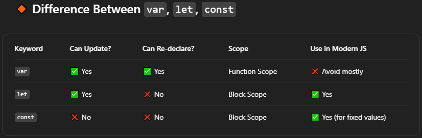

# 1. Console Functions in JS

+ ``` document.write(" Upcoming race weekend is BAHARIN GP ")```
   + we add text in webpage using js

+ ```alert("SPAS addeed alert on website frontend")```
   + addeed alert on website frontend
### *Console API Functions:*
***
+ ```console.log("SPAS added text in cosole not in website frontend"); ```
   +   added text in cosole not in website frontend

+ ```console.warn("This is an Warn on console");```  
   + Added warn in console same as warning which we are using in webpage

+ ```console.error("This is an error on console");```
    + Added error in console
+ ```console.clear()```
    + we use this function on webpage console to clear it
***
***    
# 2. Variables in js:


***
***
# 3. Operators in js


# 4. function in js
```
function avg(a , b){
    return (a+b)/2;
}

c1 = avg(2,3)
// console.log(c1)
```
# 5. if else in js
```var age = 18
if (age >= 18){
    console.log("You can drink feruchi drink");
}
else{
    console.log("You can drink Rasna");

}
```
```
age = 20    // here we have overright age variable

if ( age <= 10 ){
    console.log("Race 1-10")
}
else if(age <= 20 ){
    console.log("Race 11 -20")
}
else{
    console.log("Race with fernando alonso ")
}
```
# 6. Loops in js
## foreach used for taking out each value of array 
```
var arry = [1,2,3,4,5,6,7,8,9]

arry.forEach(element => {
    console.log(element)
});
```

```
let narry = [1,2,3,4,5,6,7,8,9];

for (let i =0; i <= narry.length; i++) {
    console.log(i);
}
```
```
for(let i = 1; i<=25 ; i++){
        console.log(i);
}
```


## while loop in js
```
warry = [1,2,3,4,5];

let w = 0;
while( w < warry.length){
console.log(warry[w]);
w++
}
```

***
***
# 7. methods in js

**metharry = [1, "two" , true , 99 ];**
+ ```console.log(metharry.length);```

+ ```metharry.pop();```  Remove last value from array

+ ```metharry.push("wheelchair");``` To add value in array at last

+ ```metharry.shift();``` Remove first value from array

+ ```metharry.unshift("new added value from unshift");``` To add value in array at front

+ ```console.log(metharry.tostring());``` To convert string to string

+ ```metharry.sort();``` Sort values in array

+ ```console.log(metharry);```
```
let ndate = new Date();
console.log(ndate.getTime());
```

# 8. doc element methods (dom)
+ ```let docid = document.getElementById("firstcontainer");``` Fetch element with firstcontainer id


+ ```console.log(docid);```
